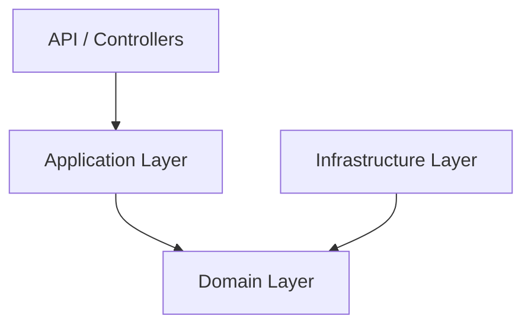
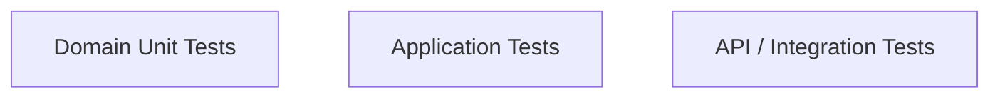

# Domain-Driven Design with Scrum using C# (.NET)

> **A real-world, end-to-end DDD implementation using Scrum, Microsoft .NET, and C#**
> Domain: **School Management System** (Core Bounded Context: **Admissions**)

This repository accompanies a **YouTube video tutorial series** that explains **Domain-Driven Design (DDD)** the way it is actually practiced in the software industry—incrementally, collaboratively, and aligned with the **Scrum framework**.

---

## 🎯 Purpose of This Repository

Most DDD examples:

* Are overly theoretical
* Ignore Agile/Scrum realities
* Show isolated code snippets
* Don’t scale from beginner to senior level

This project is different.

### What You’ll Learn Here

* How DDD works **inside real Scrum teams**
* How a domain model **evolves sprint by sprint**
* How to write **rich domain models in C#**
* How to structure **enterprise-grade .NET solutions**
* How to avoid **common DDD and Clean Architecture mistakes**

---

## 🧠 Target Audience

This repository is designed for:

* Beginners learning DDD for the first time
* Intermediate developers moving beyond CRUD
* Senior developers refining architecture decisions
* Architects working with .NET and legacy systems

> 📌 The series intentionally progresses from **Beginner → Senior level**.

---

## 🏫 Domain Overview – School Admissions

We use a **School Management System** because it is:

* Universally understood
* Rich in real business rules
* Naturally divided into bounded contexts

### Bounded Contexts (High Level)

* Admissions (**Core Domain**)
* Academics
* Fees & Payments
* Staff Management

This repository focuses on **Admissions**, while other contexts are referenced to demonstrate **strategic DDD** concepts.

---

## 🌀 Scrum-Driven Learning Approach

Each **Sprint** represents a realistic DDD milestone.  
Each sprint:  

* Has a clear goal
* Produces a usable increment
* Maps directly to Git branches, commits, and tags

| Sprint   | Focus                                  |
| -------- | -------------------------------------- |
| Sprint 0 | Domain discovery & ubiquitous language |
| Sprint 1 | Strategic DDD (Bounded Contexts)       |
| Sprint 2 | Tactical DDD (Aggregates & Invariants) |
| Sprint 3 | Domain model in C#                     |
| Sprint 4 | Domain behavior                        |
| Sprint 5 | Persistence (EF Core)                  |
| Sprint 6 | Application layer                      |
| Sprint 7 | API layer                              |
| Sprint 8 | Testing & quality                      |

---

## 🏗️ Architecture Overview

This project follows **Clean Architecture + DDD principles**:  



### Key Rules

* Domain has **zero external dependencies**
* Business logic lives in the **Domain**, not services
* Infrastructure is a **detail**, not the core

---

## 📁 Repository Structure

```
ddd-with-scrum-dotnet-school
│
├── docs
│   ├── domain
│   │   ├── ubiquitous-language.md
│   │   ├── domain-glossary.md
│   │   └── invariants.md
│   │
│   ├── architecture
│   │   ├── bounded-contexts.md
│   │   ├── context-map.md
│   │   └── diagrams
│   │
│   └── scrum
│       ├── product-backlog.md
│       ├── sprint-0.md
│       ├── sprint-1.md
│       └── definition-of-done.md
│
├── src
│   ├── School.Admissions.Domain
│   ├── School.Admissions.Application
│   ├── School.Admissions.Infrastructure
│   └── School.Admissions.API
│
├── tests
│   ├── School.Admissions.Domain.Tests
│   ├── School.Admissions.Application.Tests
│   └── School.Admissions.Integration.Tests
│
└── README.md
```

---

## 🌳 Git Branching Strategy

This repository follows a **Scrum-aligned Git strategy**.

### Main Branches

* `main` → stable, production-ready
* `develop` → integrated sprint work

### Sprint Branches

```
sprint/sprint-<number>-<goal>
```

Example:

```
sprint/sprint-3-domain-model-csharp
```

### Feature Branches

```
feature/<story-id>-<description>
```

Example:

```
feature/ADM-101-create-admission-aggregate
```

---

## 📝 Commit Message Convention

```
<type>(<scope>): <description>
```

Examples:

```
feat(domain): add AdmissionApplication aggregate root
refactor(domain): move approval logic into aggregate
test(domain): add unit tests for admission invariants
docs: add ubiquitous language glossary
```

This keeps **traceability** between:

* Scrum stories
* Code changes
* Architectural decisions

---

## 🧪 Testing Philosophy

DDD-friendly testing pyramid:



### Principles

* Most tests live in the **Domain**
* Domain tests use **no mocks**
* Fast feedback, safe refactoring

---

## 📺 YouTube Series Mapping

Each sprint in this repository corresponds to a **playlist section** in the YouTube series:

**“Domain-Driven Design with Scrum in C# | Real World .NET Architecture”**

You can:

* Checkout a sprint tag
* Follow the video
* Compare design evolution step-by-step

---

## 🚀 How to Use This Repository

1. Clone the repository
2. Checkout a sprint tag (example: `v3.0-domain-model`)
3. Watch the corresponding YouTube video
4. Explore code + docs together

This repository is meant to be **studied, not just run**.

---

## 🧭 What’s Coming Next

Planned future expansions:

* Domain Events
* CQRS
* Multiple bounded context integration
* Refactoring legacy MVC applications into DDD

---

## 🙌 Final Note

This project reflects **real-world DDD**, not textbook DDD.

If you are tired of:

* Anemic domain models
* Over-engineered architectures
* DDD that doesn’t survive Scrum

👉 You are in the right place.

Happy learning & clean modeling 🚀
